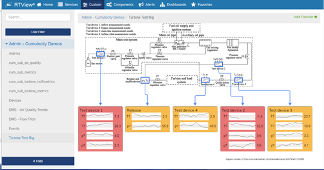

# RTView-Cumulocity Project
Using RTView with Software AG Cumulocity - IoT Device Management

## Overview
This project provides tools and examples that show how to use RTView Cloud with the Software AG Cumulocity IoT Device Management Platform to readily create and deploy rich graphical displays connected to real-time and historical Cumulocity data. 



By following the steps described below you will:

* Create an account on RTView Cloud.
* Run a small Node.js connector program that enables access from RTView Cloud to Cumulocity device and event data.
* Import into RTView Cloud a few sample displays showing real-time and historical data coming from your devices. 
* See how to create new dashboards showing your device data in customized views.

## Create an RTView Cloud account
An RTView Cloud account provides the tools for creating, viewing and publishing rich graphical displays connected to real-time data sources.

* In a browser, go to [RTView Cloud](http://rtviewcloud.sl.com/).
* Click on Start Free Trial to create your account (skip if you have an account already).
* Login to your RTView Cloud account.

Note that you are automatically placed into your own private organization (e.g. JohnSPrivateOrg).

In the next two sections, you will learn how to connect to your own device data in Cumulocity.
If you do not have a Cumulocity account, SL Corporation provides several devices in a demo account that can be viewed in RTView Cloud. You can skip to the instructions at the end of this README for connecting to these demo devices.
	
## Install and run the RTView Cumulocity connector

Clone this RTView-Cumulocity project to your local computer and follow the steps below to install and run the RTView Cumulocity connector program. This simple Node.js program provides access from RTView Cloud to current and historical device data in Cumulocity.

(Note: In the future, SL may provide this connector as a standard feature of RTView Cloud. For now, it must be run locally in order to connect to Cumulocity with your credentials.)

To install the connector program, be sure you have Node.js version 6 or higher installed on your computer, and then do the following:
```
cd RTView-Cumulocity-Node

npm install
```
Edit the following lines in the USERINFO.json configuration file, replacing 'myaccount', 'myemail', and 'mypassword' with your valid credentials:
```
"username": "myaccount/myname@myemail",
"password": "mypassword",
"baseURL": "https://myaccount.cumulocity.com"
```
To start the program:
```
node cumulocity_connector.js
```
The connector program should start and open http port 8081 on your machine. RTView Cloud will be configured in the next section to access your data via this connector process.

## Import and view the sample RTView-Cumulocity displays

* In a browser, go to [RTView Cloud](http://rtviewcloud.sl.com/).

* Define a connection to the RTView Cumulocity Connector running on your local system:
```
On the RTView Cloud top menu bar, select Data.
Select the Add RTView Server button.
In the Add RTView Server dialog enter:

	Name:       CUM-IOT-DATA
	Host/URL:   http://localhost:8081/rtvquery

Click on Save Added Servers.
```
* Test that the connection is successful:
```
Click on the green magnifying glass icon next to the CUM-IOT-DATA entry.
This will invoke the RTView DataServer - Cache Tables dialog.
Verify that you see "Connected" under Connection Status. 
Verify that you see CumDevice and other similar cache tables in the Cache Table display.
Close the dialog.
```
* Import the sample displays:
```
On the RTView Cloud top menu bar, click on Design to invoke the RTDraw visual editing tool.
Select the File dropdown menu and click on Import... 
In the file browser, navigate to the RTView-Cumulocity-Displays directory within this project.
Select all displays and click Open.
```
* View or edit the sample displays:
```
Select the File dropdown menu and click on Open...
Double click the name of the display you would like to open and view in real-time.
```
The sample displays are configured to connect to an RTView Data Server, named CUM-IOT-DATA, which you have already set up in a previous step. These displays present data, changing in real-time.
You can experiment with the editing features of RTDraw to make changes to these displays or create your own custom displays and dashboards.

## How to view the RTView-Cumulocity demo devices

For convenience, SL Corporation provides several demo devices that you can view in RTView Cloud, even if you do not have your own Cumulocity account or interesting device data stored there.

Follow the instructions in the previous section titled "Import and view the sample RTView-Cumulocity displays".
Instead of defining the the CUM-IOT-DATA to be on localhost, use the following URL to reference the demo devices provided by SL Corporation:
```
In the Add RTView Server dialog enter:

	Name:       CUM-IOT-DATA
	Host/URL:   http://sl-iot-server-4.slsandbox.com/cumulocity_rtvproxy

Click on Save Added Servers.
```
In this case, the provided displays will show data coming from the demo devices provided by SL Corporation.

## Achieved Goals

In this RTView-Cumulocity project you will have achieved the following: 

* Seen how easy it is to display Cumulocity topics in graphical and highly configurable displays in the Cloud.
* Launched the simple node program used to access device data in Cumulocity, subscribing to devices of interest.
* Seen how users are able to view or enhance the sample RTView displays or create new displays.

**Feel free to experiment with, modify or enhance this project, and share your experience, comments and suggestions with us. Please fork this repo and submit a pull request for any changes you would like to suggest.**
